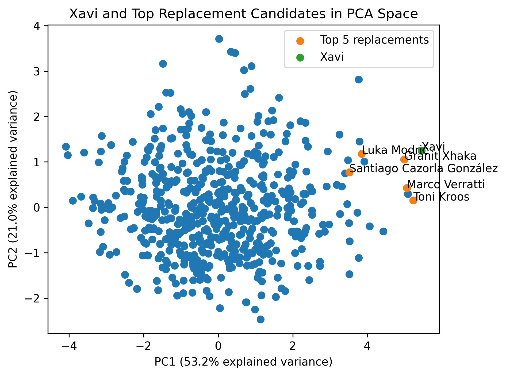
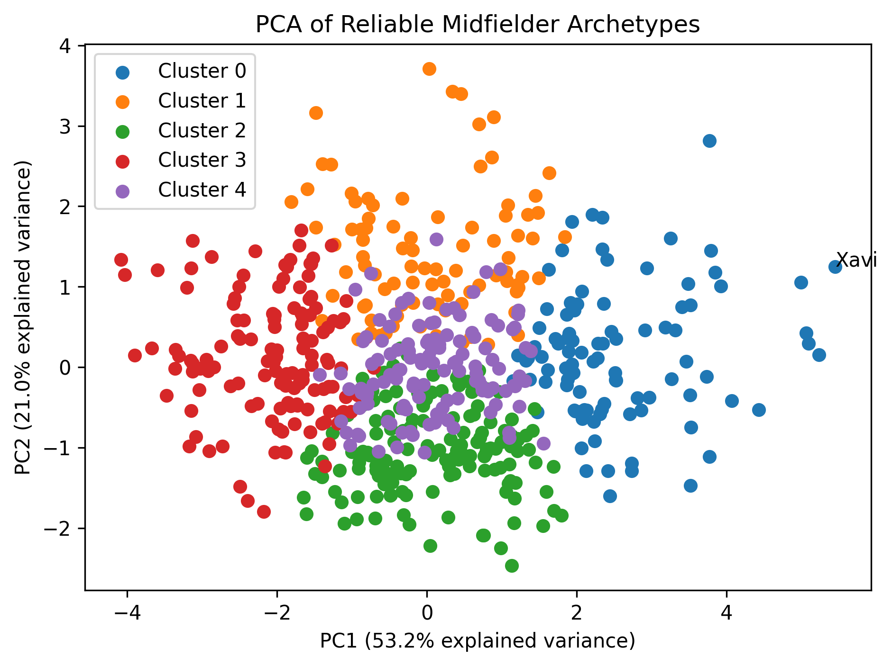

# Football Scouting Intelligence System

An end-to-end football analytics and machine learning project that uses
StatsBomb event data to identify player playing styles, discover statistical
archetypes, and recommend potential replacement players.

The project covers the full analytics pipeline from raw JSON data and
relational database design to SQL feature engineering and machine learning.

## Project Goal

The system is designed to answer scouting questions such as:

> Which players have a similar statistical profile to a target player, and
> which of them could be strong replacement candidates?

Rather than relying only on goals and assists, player profiles are constructed
from event-level actions including passing, carrying, shooting, dribbling,
and other aspects of play.

## Pipeline

```text
StatsBomb Open Data
        ↓
JSON Parsing & Validation
        ↓
Parquet + MySQL
        ↓
SQL Player Feature Engineering
        ↓
Role-Specific Player Profiles
        ↓
Similarity & Performance Modeling
        ↓
PCA + Player Archetype Clustering
        ↓
Replacement Recommendations
```

## Current Modeling Approach

The current interpretable baseline uses:

- Role-specific player comparison
- Minimum 20-match reliability filtering
- Standardized player features
- Euclidean-distance similarity
- Role-relative percentile performance scores
- PCA for visualization and interpretation
- K-Means for player-archetype discovery

For midfielders, the current similarity space uses:

- Pass completion rate
- Progressive passes per match
- Passes per match
- Progressive carries per match
- Dribble success rate

The replacement model currently combines **75% player similarity** with
**25% role-relative performance**.

## Case Study: Replacing Xavi

Xavi Hernández is used as the initial case study for the midfielder
recommendation system.

The baseline model identifies players including **Marco Verratti, Granit
Xhaka, Luka Modrić, Toni Kroos, and Santiago Cazorla** among the strongest
replacement candidates.

PCA provides an interpretable two-dimensional view of the player space.
The first two principal components retain approximately **74% of the variance**
in the five midfielder features.



## Midfielder Archetypes

K-Means clustering was used to discover statistical midfielder archetypes
from the same standardized feature space.

The resulting clusters show distinct patterns of passing involvement,
ball progression, carrying, and dribbling behavior.

Xavi appears as an extreme member of the high-volume progressive-passing
group.



## Technology Stack

**Data Engineering:** Python, Pandas, Parquet, SQLAlchemy  
**Database & Analytics:** MySQL, SQL  
**Machine Learning:** Scikit-learn, NumPy  
**Visualization:** Matplotlib, Jupyter Notebook

## Repository Structure

```text
database/       SQL schema, analysis, validation, and player features
notebooks/      Exploratory analysis and modeling
src/            Reusable parsing and data pipeline code
reports/figures/ Model and scouting visualizations
```

## Current Status

Completed:

- Normalized StatsBomb relational database
- Reusable JSON → Parquet → MySQL pipeline
- SQL player-level feature engineering
- Role and primary-position inference
- Reliability-aware player comparison
- Player similarity and replacement ranking
- PCA midfielder analysis
- K-Means midfielder archetype discovery

The current work is converting the validated modeling experiments into
reusable scouting modules and expanding the system beyond midfielders.

## Model Roadmap

The interpretable baseline will be compared against more advanced approaches,
including:

- Cosine similarity and nearest-neighbor retrieval
- Alternative clustering algorithms
- UMAP visualization
- Role-specific models for defenders, forwards, and goalkeepers
- Learned player embeddings / autoencoders
- Team-style and tactical-fit modeling
- Transfer-target ranking

Longer term, the modeling pipeline will be exposed through a FastAPI service,
tracked with MLflow, containerized with Docker, and connected to an interactive
scouting interface.

## Data

The project uses
[StatsBomb Open Data](https://github.com/statsbomb/open-data).

Large raw and processed datasets are excluded from version control and can
be reconstructed from the original StatsBomb data.

## Status

Active development.
