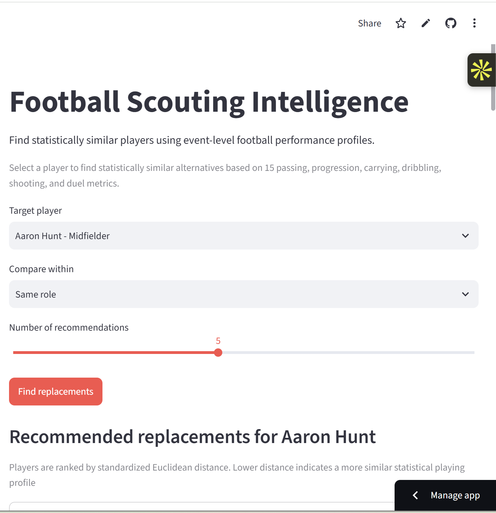
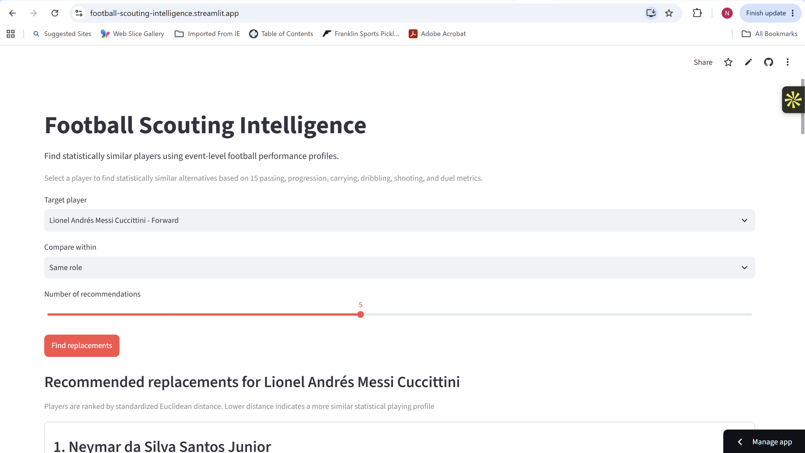

# Football Scouting Intelligence

An end-to-end football analytics system that identifies statistically similar players and recommends potential replacements using event-level performance data.

**[Live Demo](https://football-scouting-intelligence.streamlit.app/)**




Built with **Python, SQL, MySQL, scikit-learn, FastAPI, Docker, Streamlit, Render, and AWS**.

---

## Overview

Football Scouting Intelligence transforms StatsBomb event data into player performance profiles and uses those profiles to find statistically similar players.

The system covers the full pipeline:

**StatsBomb Data → SQL Feature Engineering → Player Profiles → Model Evaluation → Similarity Retrieval → FastAPI → Interactive Dashboard**

Users can:

- Search across 1,633 qualified player profiles
- Find replacement candidates within the same role, exact position, or full player population
- Compare candidates across 15 performance metrics
- View role-relative percentile profiles
- Inspect which attributes make two players most similar and where they differ

---

## Results

The final scouting population contains:

- **88,513** eligible player-match observations
- **1,633** reliable player profiles
- **15** engineered performance features
- **17** automated tests covering API, recommendation, explanation, and minutes logic

Several representation and retrieval approaches were evaluated rather than assuming the most complex model would perform best.

| Method | Role Coherence@10 | Random Split Stability@10 | Temporal Stability@10 |
|---|---:|---:|---:|
| Euclidean | **66.26%** | **12.46%** | **8.62%** |
| Cosine | 65.17% | 10.90% | 7.58% |
| PCA | 63.10% | 8.60% | 5.88% |
| Autoencoder | 58.58% | 5.06% | 3.81% |
| Random baseline | 29.62% | — | — |

**Standardized Euclidean distance** was selected for production because it produced the strongest neighborhood coherence and stability across the retrieval evaluations.

A 5-dimensional autoencoder was also trained and reduced held-out reconstruction MSE by **37.5% compared with 5-component PCA**. However, its learned embeddings produced weaker scouting neighborhoods.

This distinction was important: **better compression did not automatically produce better player recommendations**, so the production method was selected using downstream task performance rather than model complexity.

---

## Scouting Features

Player profiles are built from passing, progression, carrying, dribbling, shooting, and duel performance:

- Passes / 90 and pass completion
- Progressive passes / 90 and progressive pass rate
- Carries / 90 and progressive carries / 90
- Dribbles / 90 and dribble success
- Shots / 90, goals / 90, and xG / 90
- Average xG / shot
- Duels / 90, successful duels / 90, and duel success

Players must have at least **20 qualifying matches**, with a qualifying player-match requiring at least **20 minutes played**.

---

## System Architecture

```text
StatsBomb Event Data
        │
        ▼
   Data Parsing
        │
        ▼
      MySQL
        │
        ▼
SQL Feature Engineering
        │
        ▼
Player-Match Profiles
   88,513 observations
        │
        ▼
Player Aggregation
   1,633 profiles
        │
        ▼
Model Evaluation
 ┌────────┬────────┬─────┬─────────────┐
 │Euclidean│ Cosine │ PCA │ Autoencoder │
 └────────┴────────┴─────┴─────────────┘
        │
        ▼
Standardized Euclidean Retrieval
        │
        ▼
 Explainable Scouting Engine
        │
        ▼
      FastAPI
        │
        ▼
 Interactive Streamlit Dashboard
```

The serving layer uses a precomputed Parquet artifact containing the qualified player profiles, keeping the production API independent of the development database.

---

## Interactive Dashboard

The deployed application allows users to select a target player, control the comparison scope, retrieve ranked replacement candidates, and interactively compare statistical profiles.

Recommendations include:

- Similarity distance
- Player role
- Number of qualifying matches
- Most similar attributes
- Largest statistical differences
- Role-relative percentile comparison

Lower standardized Euclidean distance indicates a more similar statistical playing profile.

**[Open the live application](https://football-scouting-intelligence.streamlit.app/)**

> The free API hosting instance may need a short startup period after inactivity.

---

## API

The recommendation engine is exposed through FastAPI.

Example endpoints:

```text
GET /health
GET /players
GET /players/{player_id}/profile
GET /players/{player_id}/percentiles
GET /players/{player_id}/replacements
```

Example:

```text
GET /players/20131/replacements?top_n=5&position_filter=role
```

The API supports comparisons across:

- `role` — same broad playing role
- `position` — same primary position
- unrestricted player population

---

## Deployment

The API is packaged as a Docker container and deployed publicly through Render, while the interactive frontend is hosted on Streamlit Community Cloud.

The API container was also deployed and verified on **AWS ECS/Fargate**, with the image stored in **Amazon ECR**, providing an additional production deployment implementation.

Docker optimization reduced:

- Image size from approximately **848 MB to 613 MB**
- Build context from **15.58 GB to kilobytes**

The production container contains only the API source, dependencies, and precomputed scouting artifact rather than the raw dataset, notebooks, tests, or development database.

---

## Repository Structure

```text
database/                  SQL schema, feature engineering, and validation
data/artifacts/            Production scouting profiles
notebooks/                 Exploration and model experiments
reports/                   Evaluation outputs and figures
scripts/                   Artifact generation and pipeline verification

src/
├── api/                   FastAPI application
├── dashboard/             Streamlit interface
├── data/                  Data access
├── evaluation/            Evaluation metrics
├── features/              Player feature/minutes logic
└── scouting/              Retrieval and explanation engine

tests/                     Automated test suite
Dockerfile                 Production API image
```

---

## Running Locally

Install the API dependencies:

```bash
pip install -r requirements-api.txt
```

Start FastAPI:

```bash
uvicorn src.api.main:app --reload
```

In another terminal, install the dashboard dependencies:

```bash
pip install -r requirements-dashboard.txt
```

Then start Streamlit:

```bash
streamlit run src/dashboard/app.py
```

The dashboard defaults to:

```text
http://127.0.0.1:8000
```

for the local API and supports a configurable `API_URL` for deployed environments.

### Docker

Build the API image:

```bash
docker build -t football-scouting-api .
```

Run it:

```bash
docker run --rm -p 8000:8000 football-scouting-api
```

Then visit:

```text
http://127.0.0.1:8000/docs
```

---

## Data

This project uses **StatsBomb Open Data**.

StatsBomb event data provides detailed match events including passes, carries, shots, dribbles, duels, player information, positions, and match metadata.

This repository does not require the raw dataset for production serving; the deployed recommendation system uses a precomputed scouting artifact.

---

## Key Takeaway

This project was designed as more than a similarity-model experiment. It evaluates the complete decision pipeline from raw football events through feature engineering, representation learning, retrieval validation, API serving, containerization, cloud deployment, and an interactive scouting interface.

A central finding was that the more complex representation was not the strongest retrieval system: although the autoencoder substantially improved reconstruction over PCA, standardized Euclidean distance produced more coherent and stable player neighborhoods and was therefore selected for production.
